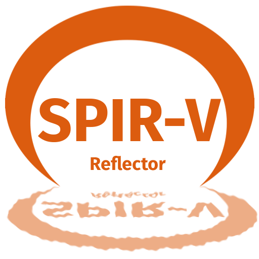

Provides binding and statistical information about SPIR-V shader bytecode, which could be used for anything from automatic shader pipeline bindings to debug/analysis capability.

# Build Status
 

   
